# Travel World - Website

# Introduction
Project milestone 1 for Code Institute Full-stack development program: HTML/CSS Essentials

This project is to create a Front End website for a Travel Company. A business’s online presence, regardless of industry, can have a massive impact on its success. The main purpose is to show the users, the company and promote the brand to a new clients, displaying tours around the world and interactive with a user throughout a contact form and social media.

[Live Project Here](https://pedrocristo.github.io/portfolio_project_1/index.html)

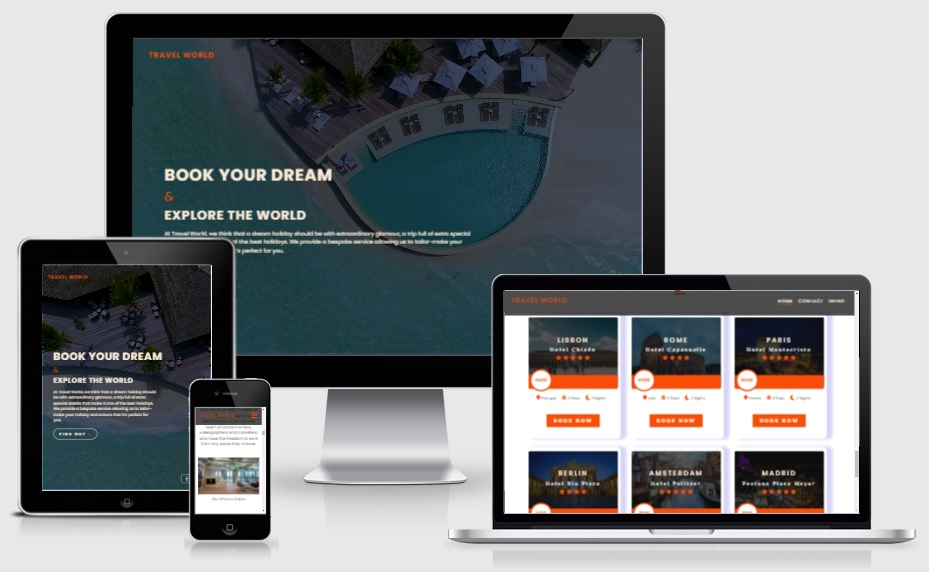

## User Experience (UX)

-   ### User stories

    -   #### As a new visitor, I want to:

        1. To understand the main purpose of the site.
        2. To be able to easily navigate throughout the site and find a relevant content about package holidays.
        3. To be able to contact the company for more information in an easy way.

    -   #### As a returning, I want to:

        1. To find a new available package holidays.

-   ### Design

    -   #### Colour Scheme
        -    There are four main colors used, white (#ffffff), a variation of white (#faebd7) an orange tone (#f84f0d) and a black (#111111). The white is used to fit the                  main website background, the black is used for text while the orange represents a color tone that can be seen in the logo, titles and icons. The variation of                  white (#faebd7) is used for the button background when hovered.

    -   #### Typography
         -   The Poppins , sans-serif is used as the main font for the whole website.
         -   The El Messiri, sans-serif is used to display the hotels name on the cards.
    -   #### Imagery

          - 3 background images one in the Header and another two in the Banner Section.
          - 6 Images for the icones in the Tust Section wit the size of 48px by 48px. They are PNG files.
          - 2 images in the about section with the size of 680px by 410px.
          - 12 images for the Top Trips Section and City Breack Section with the size of 1440px by 1920px displayed on desktop and tablet.
          - 12 images for the Top Trips Section and City Breack Section with the size of 950px by 713px displayed on mobile devices.
          - 8 Images in the Partners Section with the size of 580px by 280px.
          - 1 image GiF animation in the Thanks Page.
          - Please Note (All images were converted to the webp files except the 6 images in the Trust Section).

    -   #### Videos
        - The Landing Page has one video as a background displaying in muted, loop and autoplay.

    -   #### Google Maps
        -   The web site has a Google Maps location implemented where the users can find the office in Dublin.

## Features

-   Responsive on all device sizes between 280px-2600px wide

-   Interactive elements (Social links)

### Landing Page 

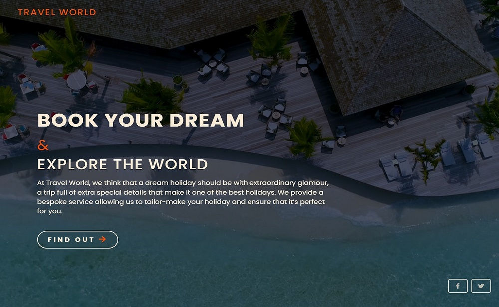

- The Landing Page is the first contact that users have with the website. This page works as a cover with a video playing in the background and has some text as marketing slogan trying to keep the users in the website. The button drives the viewers to the homepage when is pressed.  
[Live Page Here](https://pedrocristo.github.io/portfolio_project_1/index.html)

### Home Page Header

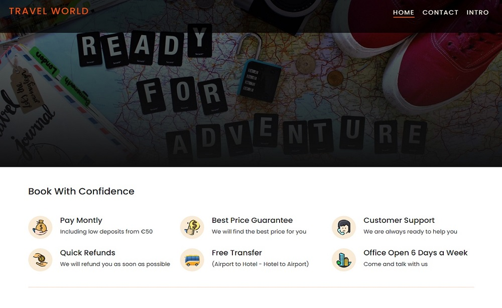
- In this feature the user have access to the navbar fixed on the top of the page to navigate throughout the website. They can see a background travel theme on the page and get some information about how the users can trust the company with some services displayed.  
[Live Page Here](https://pedrocristo.github.io/portfolio_project_1/home.html)

### About Section

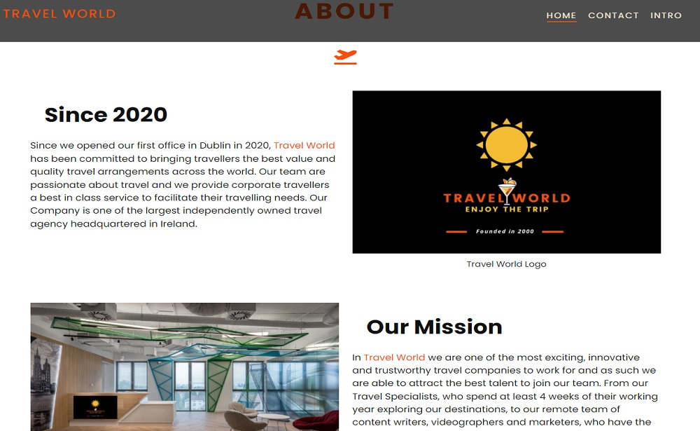

- In this feature users have access to information about the company, like what is the main purpose of the company, year of founded and also the benefits to work for Travel World.  
[Live Feature Here](https://pedrocristo.github.io/portfolio_project_1/home.html#about-section)

### Banner Section 1

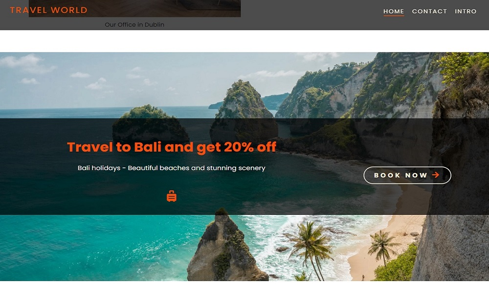

- This feature is a highlights banner where user can see a travel deal and book the trip pressing the button on the page and ring the Travel World office. 
[Live Feature Here](https://pedrocristo.github.io/portfolio_project/home.html#banner-1)

### Top Trips Section

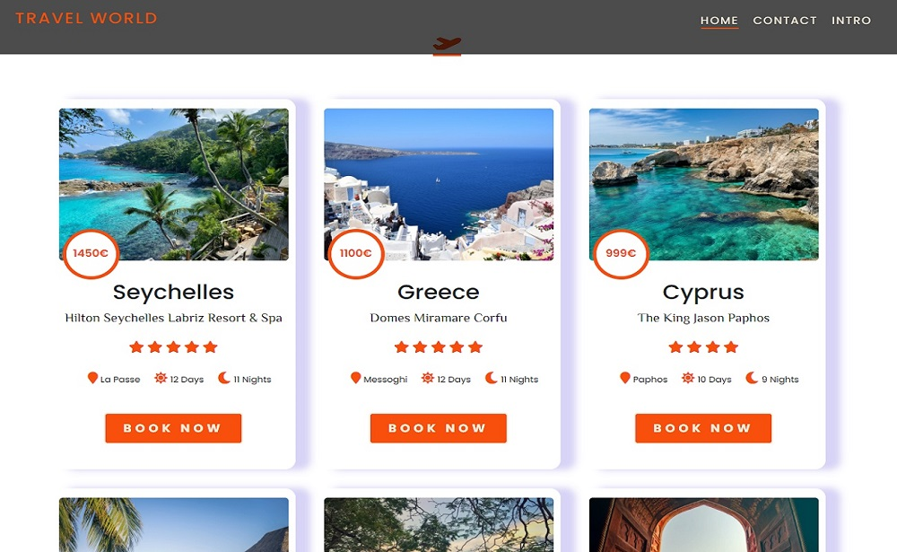

- This feature is a cards section where users can see the top travel deals displayed with information about city, country, price, hotel name, hotel stars, number of days and nights. The card has a button where the user can book and when is hovered by the user the box-shadow changes. 
[Live Feature Here](https://pedrocristo.github.io/portfolio_project_1/home.html#top-trips)

### Banner Section 2

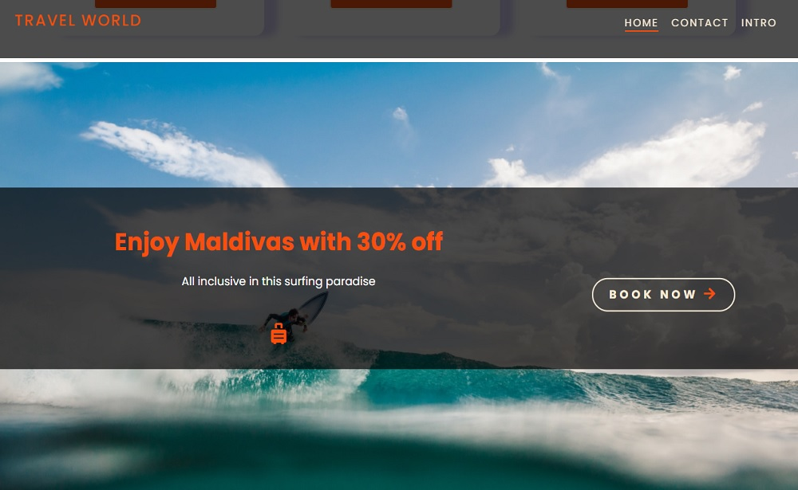

- This features has the same purpose as the Banner 1 Section with a different travel deal displayed. 
[Live Feature Here](https://pedrocristo.github.io/portfolio_project_1/home.html#banner-2)

### City Breaks Section

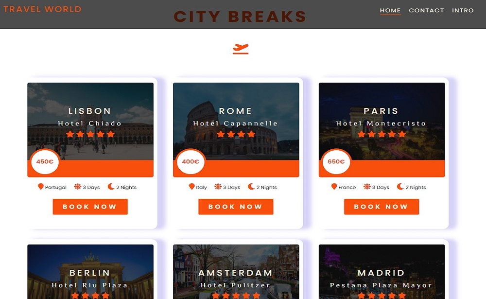

- This features has the same purpose as the Top Trip Section with a difference that when the card is hovered by the user the image zoom in. 
[Live Feature Here](https://pedrocristo.github.io/portfolio_project_1/home.html#city-trips)

### Partners Section

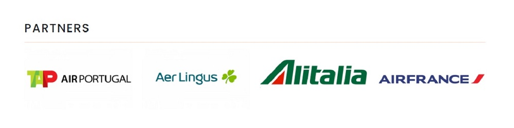

- In this section users can see partners and companies that Travel World work with. 
[Live Feature Here](https://pedrocristo.github.io/portfolio_project_1/home.html#partners-section)

### Footer Section

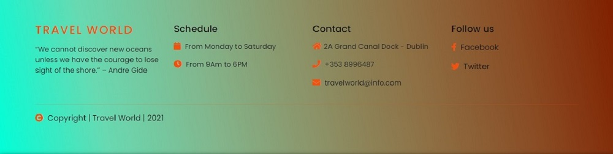

- This feature is the Footer Section and users can see information about company's schedule and contact also Travel World social media links. The copyright message is displayed on the bottom. 
[Live Feature Here](https://pedrocristo.github.io/portfolio_project_1/home.html#footer)
## Technologies Used

### Contact Page

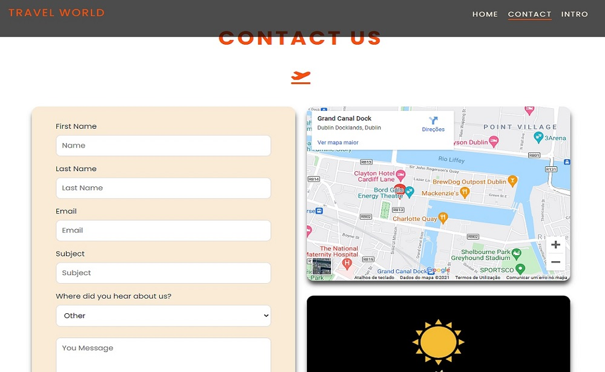

- In this page users can contact the Travel World throughout a contact form. Information about user first name, last name, email and message are required by the form. They can also see the Travel World office location o the Google Maps. 
[Live Contact Page](https://pedrocristo.github.io/portfolio_project_1/contact.html)

### Thanks Page

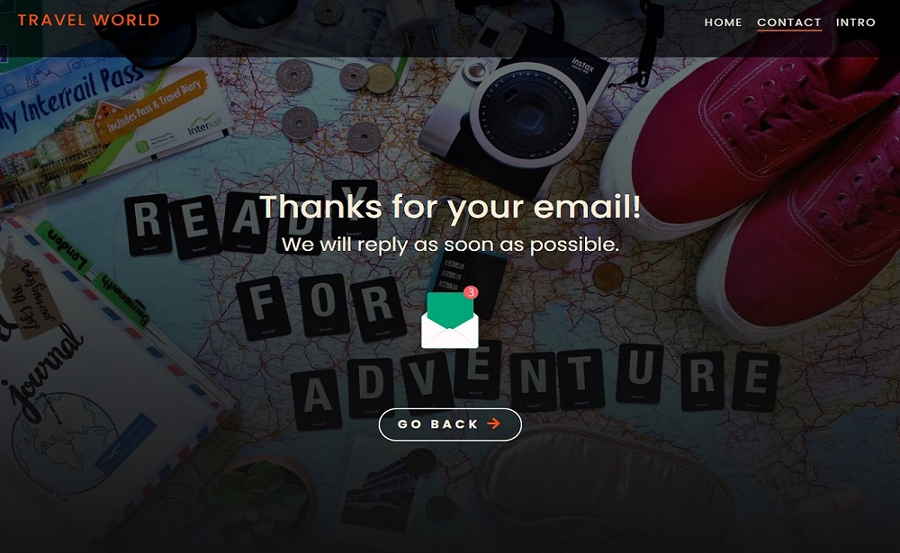

- When users submit a contact form successful they will land in this Thanks Page. There is a button on this page that when is pressed brings the users back to the contact form. 
[Live Thanks Page](https://pedrocristo.github.io/portfolio_project_1/thanks-page.html)
## Technologies Used

### Languages Used 

-   [HTML5](https://en.wikipedia.org/wiki/HTML5)
-   [CSS3](https://en.wikipedia.org/wiki/Cascading_Style_Sheets)
-   [Bootstrap](https://getbootstrap.com/)

### Frameworks, Libraries & Programs Used

1. [Google Fonts:](https://fonts.google.com/)
    - Google fonts were used to import the 'Poppins' and 'El Messiri' fonts throughout the style.css.
1. [Font Awesome:](https://fontawesome.com/)
    - Font Awesome are used as a icons for user UX purposes.
1. [Git](https://git-scm.com/)
    - Git was used for version control by utilizing the Gitpod terminal to commit to Git and Push to GitHub.
1. [GitHub:](https://github.com/)
    - GitHub is used to store the project's code after being pushed from Git.
1. [PIXLR:](https://pixlr.com/pt/)
    - PIXLR was used to create, modify and resize all images on this website.
1. [Canva](https://www)
    - Canva was used to creat the image logo, favicon and also the office image
    ## Testing

The W3C Markup Validator and W3C CSS Validator Services were used to validate every page of the project to ensure there were no syntax errors in the project.

-   [W3C Markup Validator](https://validator.w3.org/#validate_by_input) - [Website Results](https://validator.w3.org/nu/?doc=https%3A%2F%2Fpedrocristo.github.io%2Fportfolio_project_1_travel_world%2Fhome.html)
-   [W3C CSS Validator](https://jigsaw.w3.org/css-validator/#validate_by_input) - [Website Results](https://jigsaw.w3.org/css-validator/validator?uri=https%3A%2F%2Fpedrocristo.github.io%2Fportfolio_project_1_travel_world%2Fhome.html&profile=css3svg&usermedium=all&warning=1&vextwarning=&lang=en)

Google Lighthouse was used to test Performance, Best Practices, Accessibility and SEO on both Desktop and Mobile devices.

- Desktop Results:

  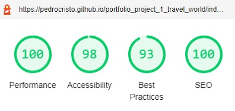

- Mobile Results:

  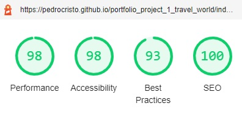

   ## Bugs

- No bugs were found while the website has been testing.

## Deployment

The website development has been done in the "main" branch. This branch has been deployed using GitHub Pages.

This site was deployed by completing the following steps:

1. Opened [GitHub](https://github.com/).
2. Click on the project to be deployed.
3. Navigated to the "Settings".
4. Navigated down to the "GitHub Pages".
5. Click on "Check it out here!".
6. Selected the "main" branch and selected "Save".
7. The link to the live website was ready on the top.

[Live Project Here](https://pedrocristo.github.io/portfolio_project_1/index.html)

## Credits

### Information Sources/Resources

* [W3Schools](https://www.w3schools.com/)

* [Stack Overflow](https://stackoverflow.com/)
  

## Content

### Images

All images were provided and used under the Unsplash licence [Unsplash.com](https://unsplash.com/license)

### Video

The video was provided and used under the Pexels licence [Unsplash.com](https://www.pexels.com/video/aerial-view-of-an-infinity-pool-in-maldives-beach-resorts-4069480/)

### Trust Section Icons

All the icons were provided and used under the Icons8 licence [Icons8.com](https://icons8.com/icons/set/best-price)

