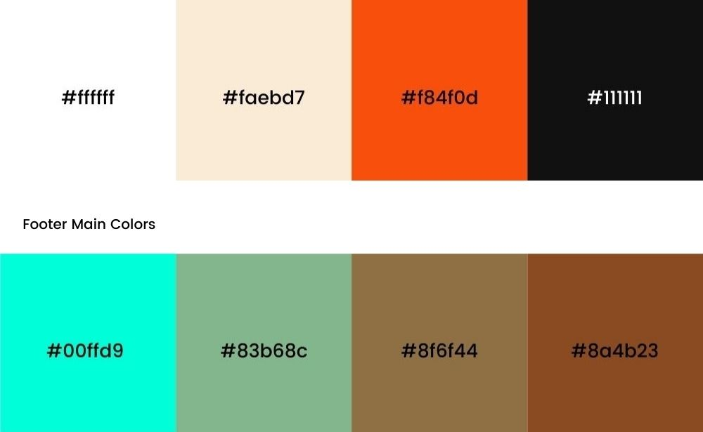
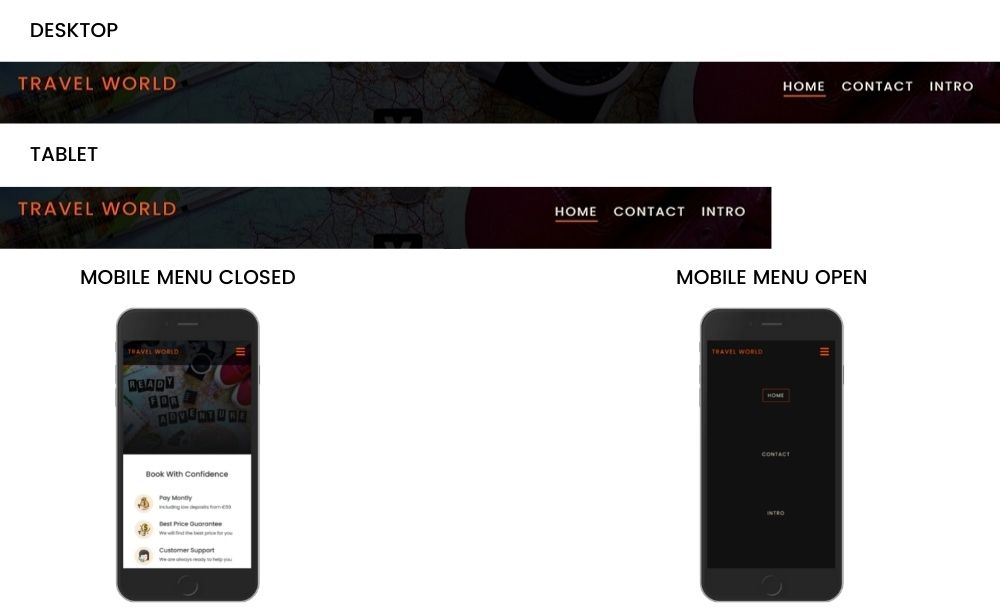

# Travel World - Website

# Introduction
Project milestone 1 for Code Institute Full-stack development program: HTML/CSS Essentials

This projectis is a Front End website for a Travel Company. A business’s online presence, regardless of industry, can have a massive impact on its success. The main purpose is to show the users the company and promote the brand to a new clients, displaying  package holidays and interactive with a user throughout a contact form and social media.

[Live Project Here](https://pedrocristo.github.io/portfolio_project_1/index.html)

## README Table Content

* [Introduction](#introduction)
* [User Experience UX](#user-experience---UX)
    * [User stories](#user-stories)
* [Design](#Design)
    * [Website Structure](#website-structure)
    * [Colour Scheme](#colour-scheme)
    * [Typography](#typography)
    * [Imagery](#imagery)
    * [Videos](#videos)
    * [Google Maps](#google-maps)
    * [Interative Links](#interative-links)
* [Features](#features)
    * [Landing Page](#landing-page)
    * [Navigation Menu](#navigation-menu)
    * [Home Page Header](#home-age-eader)
    * [About Section](#about-section)
    * [Banner Section 1 - Bali](#banner-section-1---bali)
    * [Top Trips Section](#top-trips-section)
    * [Banner Section 2 - Maldives](#banner-section-2---maldives)
    * [City Breaks Section](#city-breaks-section)
    * [Partners Section](#partners-section)
    * [Footer Section](#footer-section)
    * [Contact Page](#Contact-page)
    * [Thanks Page](#thanks-page)
* [Future Features](#future-features)
    * [Costutomer Review Section](#costumer-review-section)
* [Technologies Used](#technologies-used)
    * [Languages Used](#languages-used)
    * [Frameworks - Libraries & Programs Used](#frameworks---libraries-&-programs-used)
* [Testing](#testing)
    * [Bugs](#bugs)
    * [Website Development Issues](#website-development-issues)
* [Deployment](#deployment)
* [Credits](#credits)
* [Content](#content)

## User Experience - UX

-   ### User Stories

    -   #### As a website creator, I want to:
        1. To build the website visually appealing upon first visit so the user is intrigued to explore all the pages.
        2. To build a website easy to navigate for the users.

    -   #### As a new visitor, I want to:

        1. To understand the main purpose of the site.
        2. To be able to easily navigate throughout the site and find a relevant content about package holidays.
        3. To be able to contact the company for more information in an easy way.

    -   #### As a returning visitor, I want to:

        1. To find a new available package holidays.
        2. To find more relevant information about the company.

-   ### Design
   
    -  #### Website Structure
       -   Travel World website is a 4 pages site: Landing Page, Home Page, Contact Page and Thanks Page. The default loading page is the Landing Page and is linked to the Home Page by a button. The Home Page has 8 sections: Trust, About, Banner Bali, Top Trips, Banner Maldives, City Breaks, Parteners and Footer. This page is linked to all website by the Navigation Menu. The Contact Page has te Menu on the top and 3 sections: Contact Form, Parteners and Footer. The Thanks Page has to sections: Thanks message and Footer.

    -   #### Colour Scheme
        
        -   There are four main colors used, white (#ffffff), a variation of white (#faebd7) an orange tone (#f84f0d) and a black (#111111). The white is used to fit the      main website background, the black is used for text while the orange represents a color tone that can be seen in the logo, titles and icons. The variation of white 
        (#faebd7) is used for the button background when hovered.
        -   In the Footer Section I used a linear gradient as background using four main colors and orientation of 258 degrees.

    -   #### Typography
         -   The Poppins , sans-serif is used as the main font for the whole website.
         -   The El Messiri, sans-serif is used to display the hotels name on the cards.
         
    -   #### Imagery
          - 3 background images one in the Header and another two in the Banner Section.
          - 6 Images for the icones in the Tust Section wit the size of 48px by 48px. They are PNG files.
          - 2 images in the about section with the size of 680px by 410px.
          - 12 images for the Top Trips Section and City Breack Section with the size of 1440px by 1920px displayed on desktop and tablet.
          - 12 images for the Top Trips Section and City Breack Section with the size of 950px by 713px displayed on mobile devices.
          - 8 Images in the Partners Section with the size of 580px by 280px.
          - 1 image GiF animation in the Thanks Page.
          - Please Note (All images were converted to the webp files except the 6 images in the Trust Section).

    -   #### Videos
        - The Landing Page has one video as a background displaying in muted, loop and autoplay.

    -   #### Google Maps
        -   The web site has a Google Maps location implemented where the users can find the office in Dublin.

    -   #### Interative Links  

       -    In the bottom of the Landing Page and footer, users can access the company social links (Facebook and Twitter) opened in a new tab when is pressed.
       -    In the Banner Bali and Banner Maldivas user can ring to the company pressing the book now button.

## Features
-   Responsive on all device sizes between 280px-2600px wide

### Landing Page 

- The Landing Page is the first contact that users have with the website. This page works as a cover with a video playing in the background and has some text as marketing slogan trying to keep the users in the website. The button drives the viewers to the homepage when is pressed.  
[Live Page Here](https://pedrocristo.github.io/portfolio_project_1/index.html)

### Navigation Menu

- In the top of the website, users can find a fixed navigation menu, fully responsive in all devices. In this navigation menu users can navigate to the difference pages in the website! They can also see the Travel World logo on the left side.  
[Live Feature Here](https://pedrocristo.github.io/portfolio_project_1/home.html)

### Home Page Header

- In this features users can see travel image as a background follow down by some services provided by the company trying to show the users that is save to book a trip with Travel World.  
[Live Page Here](https://pedrocristo.github.io/portfolio_project_1/home.html)

### About Section

- In this feature users have access to information about the company, like what is the main purpose of the company, year of founded and also the benefits to work for Travel World.  
[Live Feature Here](https://pedrocristo.github.io/portfolio_project_1/home.html#about-section)

### Banner Section 1 - Bali

- This feature is a highlights banner where user can see a travel deal and book the trip pressing the button on the page and ring the Travel World office. 
[Live Feature Here](https://pedrocristo.github.io/portfolio_project_1/home.html#banner-bali)

### Top Trips Section

- This feature is a cards section where users can see the top travel deals displayed with information about city, country, price, hotel name, hotel stars, number of days and nights. The card has a button where the user can book and when is hovered by the user the box-shadow changes. 
[Live Feature Here](https://pedrocristo.github.io/portfolio_project_1/home.html#top-trips)

### Banner Section 2 - Maldivas

- This features has the same purpose as the Banner 1 - Bali with a different travel deal displayed. 
[Live Feature Here](https://pedrocristo.github.io/portfolio_project_1/home.html#banner-maldivas)

### City Breaks Section

- This features has the same purpose as the Top Trip Section with a difference that when the card is hovered by the user the image zoom in. 
[Live Feature Here](https://pedrocristo.github.io/portfolio_project_1/home.html#city-trips)

### Partners Section

- In this section users can see partners and companies that Travel World work with. 
[Live Feature Here](https://pedrocristo.github.io/portfolio_project_1/home.html#partners-section)

### Footer Section

- This feature is the Footer Section and users can see information about company's schedule and contact also Travel World social media links. The copyright message is displayed on the bottom. 
[Live Feature Here](https://pedrocristo.github.io/portfolio_project_1/home.html#footer)

### Contact Page

- In this page users can contact the Travel World throughout a contact form. Information about user first name, last name, email and message are required by the form. They can also see the Travel World office location o the Google Maps. 
[Live Contact Page](https://pedrocristo.github.io/portfolio_project_1/contact.html)

### Thanks Page

- When users submit a contact form successful they will land in this Thanks Page. There is a button on this page that when is pressed brings the users back to the contact form. 
[Live Thanks Page](https://pedrocristo.github.io/portfolio_project_1/thanks-page.html)

## Future Features
  
   ### Costumer Review Section

   - Add a Costumer Review Section in the Home page to improve the website and display customers experience at Travel World and opinion about the company.

## Technologies Used

### Languages Used 

-   [HTML5](https://en.wikipedia.org/wiki/HTML5)
-   [CSS3](https://en.wikipedia.org/wiki/Cascading_Style_Sheets)
-   [Bootstrap](https://getbootstrap.com/)

### Frameworks - Libraries & Programs Used

1. [Google Fonts:](https://fonts.google.com/)
    - Google fonts were used to import the 'Poppins' and 'El Messiri' fonts throughout the style.css.
1. [Font Awesome:](https://fontawesome.com/)
    - Font Awesome are used as a icons for user UX purposes.
1. [Git](https://git-scm.com/)
    - Git was used for version control by utilizing the Gitpod terminal to commit to Git and Push to GitHub.
1. [GitHub:](https://github.com/)
    - GitHub is used to store the project's code after being pushed from Git.
1. [PIXLR:](https://pixlr.com/pt/)
    - PIXLR was used to create, modify and resize all images on this website.
1. [Canva](https://www)
    - Canva was used to creat the image logo, favicon and also the office image
    ## Testing

The W3C Markup Validator and W3C CSS Validator Services were used to validate every page of the project to ensure there were no syntax errors in the project.

-   [W3C Markup Validator](https://validator.w3.org/#validate_by_input) - [Website Results](https://validator.w3.org/nu/?doc=https%3A%2F%2Fpedrocristo.github.io%2Fportfolio_project_1_travel_world%2Fhome.html)
-   [W3C CSS Validator](https://jigsaw.w3.org/css-validator/#validate_by_input) - [Website Results](https://jigsaw.w3.org/css-validator/validator?uri=https%3A%2F%2Fpedrocristo.github.io%2Fportfolio_project_1_travel_world%2Fhome.html&profile=css3svg&usermedium=all&warning=1&vextwarning=&lang=en)

Google Lighthouse was used to test Performance, Best Practices, Accessibility and SEO on both Desktop and Mobile devices.

The testing was done using the Google Chrome Browser. Chrome Developer Tools was used extensively, particularly to check responsiveness on different screen sizes. Testing was also done using Firefox on desktop, and again on Google Chrome and Opera on the Huawei P20.

- Desktop Results:

  

- Mobile Results:

  

   ## Bugs

- No bugs were found while the website has been testing.

   ## Website Development Issues

 - Because of a misunderstanding how to do Git Commit I was doing them wrong. After I had my first call with my mentor he clarify to me how to do it and I have been following his explanation.
## Deployment

The website development has been done in the "main" branch. This branch has been deployed using GitHub Pages.

This site was deployed by completing the following steps:

1. Opened [GitHub](https://github.com/).
2. Click on the project to be deployed.
3. Navigated to the "Settings".
4. Navigated down to the "GitHub Pages".
5. Click on "Check it out here!".
6. Selected the "main" branch and selected "Save".
7. The link to the live website was ready on the top.

[Live Project Here](https://pedrocristo.github.io/portfolio_project_1/index.html)

## Credits

### Information Sources/Resources

* [W3Schools](https://www.w3schools.com/)

* [Stack Overflow](https://stackoverflow.com/)
  

## Content

### Images

All images were provided and used under the Unsplash licence [Unsplash.com](https://unsplash.com/license)

### Video

The video was provided and used under the Pexels licence [Unsplash.com](https://www.pexels.com/video/aerial-view-of-an-infinity-pool-in-maldives-beach-resorts-4069480/)

### Trust Section Icons

All the icons were provided and used under the Icons8 licence [Icons8.com](https://icons8.com/icons/set/best-price)

